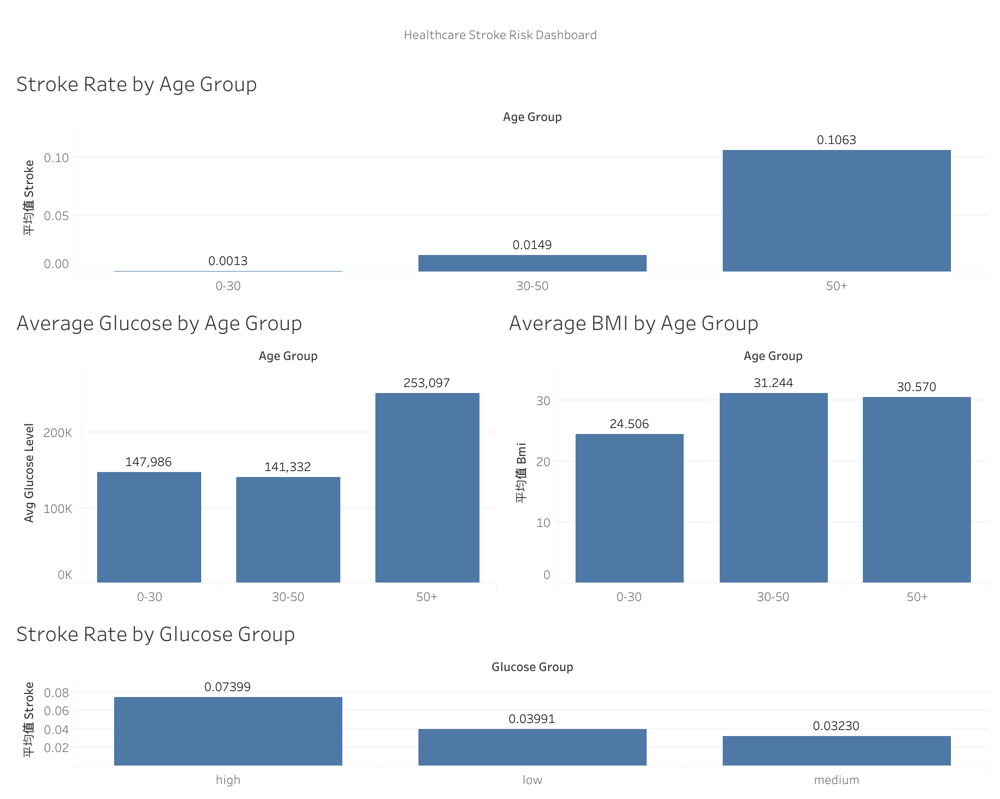

# Healthcare Stroke Prediction Analysis

## Objective
Build a portfolio-ready healthcare analytics project by cleaning a real-world dataset and analyzing factors associated with health outcomes.

## Key Questions
- What features are associated with higher risk outcomes?
- Are there demographic patterns (e.g., age, gender, lifestyle)?
- Can we identify high-risk groups for further investigation?

## Dataset
- Source: Kaggle (add link and dataset name)
- File: `data/raw/raw_data.csv`
- Cleaned: `data/cleaned/cleaned_data.csv`

## Project Structure
- `data/raw/`: original dataset
- `data/cleaned/`: cleaned dataset for analysis and visualization
- `notebooks/`: Jupyter notebooks
- `outputs/`: charts, tables, and exported results

## Progress Log
- Week 12: project initialized, data cleaning notebook created, cleaned dataset exported

# Healthcare Stroke Analysis

## Project Overview
This project analyzes healthcare data to identify high-risk populations for stroke.

## Business Problem
The goal is to find which patient groups have higher stroke risk and provide useful insights for prevention.

## Data
The dataset includes:
- age
- stroke
- average glucose level
- bmi

## Project Steps
1. Data cleaning
2. Risk factor analysis
3. Segmentation analysis
4. Dashboard preparation
5. Tableau dashboard creation

## Key Findings
- Stroke risk increases with age
- The 50+ group has the highest stroke risk
- Higher glucose groups show higher stroke risk
- BMI changes across age groups, but age and glucose are more important

## Recommendation
- Focus more on the 50+ group
- Monitor patients with higher glucose levels
- Use segmentation to identify high-risk groups

## Dashboard

## Skills Used
- Python
- pandas
- data cleaning
- exploratory data analysis
- segmentation analysis
- Tableau
- business communication
